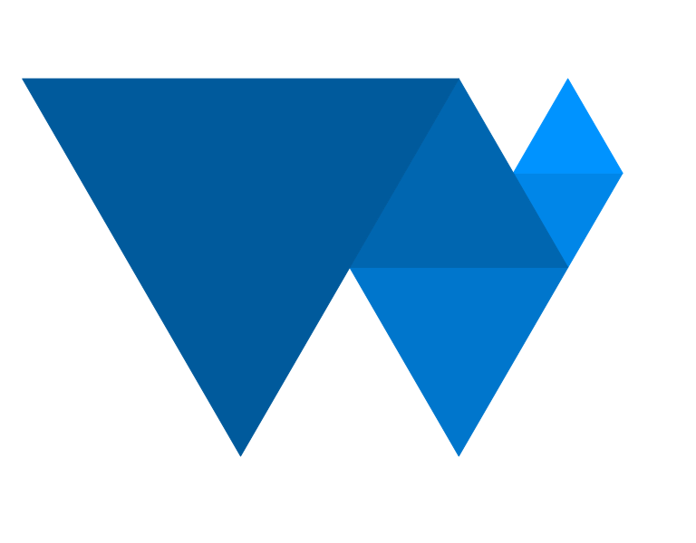
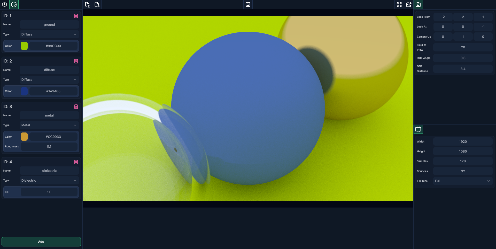
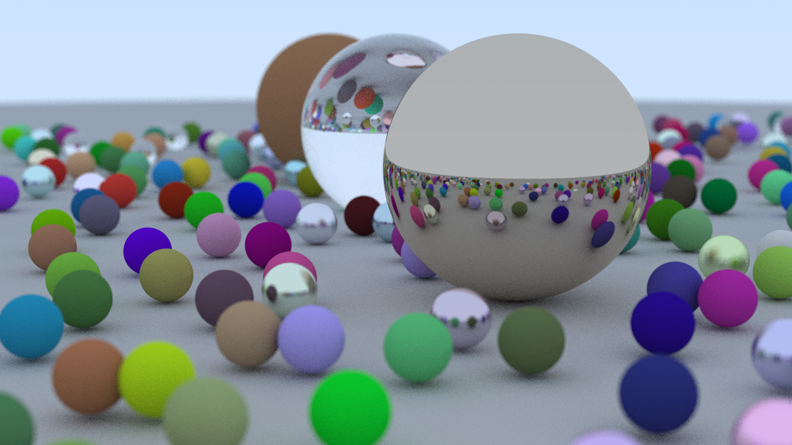

  <!--  -->
  <h1 align="center">WebRay</h1>

    
    
    
    

Webray is a WebGPU powered ray tracer + Svelte based editor

> :warning: **WebGPU**: Is an experimental api. Webray is tested on the latest desktop chrome version. your system may slow down or crash during rendering. please use webray at your own risk.

  <a href="https://github.com/BLaZeKiLL/webray/blob/main/src/data/demo_02.scene.json">Demo 02</a>
  4K @ 512 Samples, 64 Bounces. 20 mins on webray-native

## Editor Documentation

The editor is available [here](https://blazekill.github.io/webray/) along [Demo Scene 01](https://github.com/BLaZeKiLL/webray/blob/main/src/data/demo_01.scene.json) and [Demo Scene 02](https://github.com/BLaZeKiLL/webray/blob/main/src/data/demo_02.scene.json) which can be imported.

### Tools

-  Objects in the current scene
-  Download rendered image
-  Render the current scene as an image
-  Camera Settings
-  Render Settings
-  Materials in the current scene
-  Enter full screen image
-  Exit full screen image
-  Delete item
-  Download scene json file
-  Import scene json file

## WebRay Renderer

  <a href="https://github.com/BLaZeKiLL/webray/blob/main/src/data/demo_01.scene.json">Demo 01</a>
  HD @ 128 Samples, 32 Bounces. 4secs webray-native

The renderer is implemented in rust and compiled to wasm with the core kernel implemented as a wgsl compute shader using wgpu.
